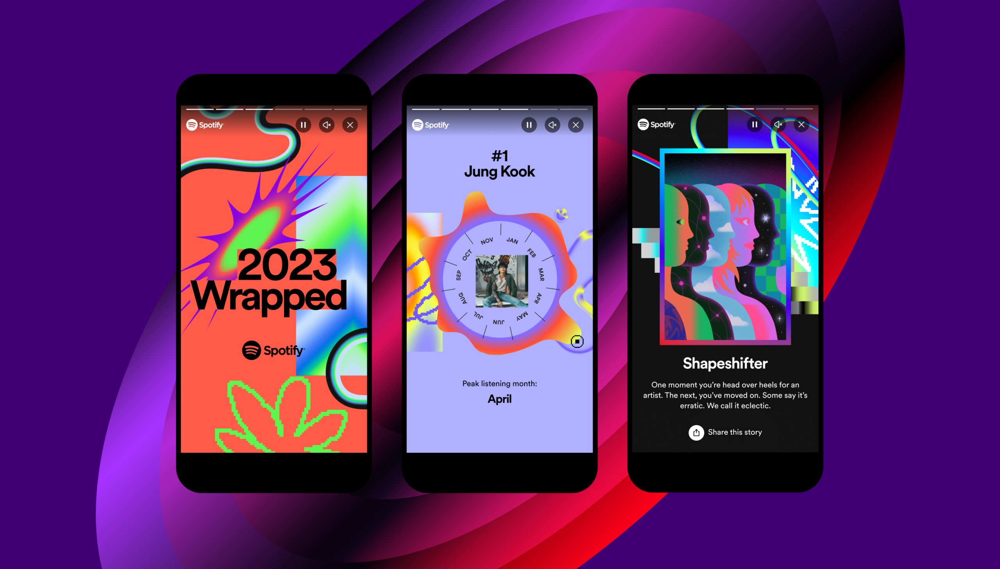

## Veille technologique

### Dash 

Dash est un framework python Open Source qui a été développé par l’équipe qui a développé la librairie Plotly. 

La principale utilisation de Dash et la création de data apps en utilisant uniquement python.
Ce framework utilise principalement trois technologies; Flask, React.js et Plotly.js. 

Les étapes de la création d’une application avec Dash sont les suivantes : 

Définir le contenu de l’application en utilisant le layout.py
Styliser l’application en utilisant CSS ou des templates via Bootstrap
Utiliser callback.py afin de rendre l’application interactive

Voici les fichiers principaux utilisés pour une application Dash : 

app.py
index.py
layout.py
callbacks.py

Afin de créer une application en utilisant Dash il faut dans un premier temps importer la librairie : 

```
From dash import Dash, html
```

Si d’autres librairies doivent être importés on peut les ajouter au fur et à mesure (ex : pandas as pd).

Ensuite il faut initialiser l’application : 

```
app = Dash(__name__)

app.layout = html.Div([
	html.Div(children=’Hello World’)
])

if __name__ == ‘__main__’:
	app.run(debug=True)
```

Ceci nous permettra de créer une page blanche dans un premier temps qui affichera le texte ‘Hello World’. 

Afin de connecter notre dataset à l’application Dash on peut procéder de plusieurs façons; une API, une base de données, des fichiers locaux (.txt, .json) etc. 
```
df = pd.read_csv(‘lien_du_csv’)
```

On importe le csv dans ce cas, via cette ligne dans un dataframe pandas. Il faut ensuite modifier le layout de cette manière : 

```
app.layout = html.Div[(
    html.Div(children=’Hello World’),
    dash_table.DataTable(data=df.to_dict(‘records’), page_size=10)
])
```

Cela permet l’ajout de DataTable en tant que component et la lecture du dataframe pandas. 

Maintenant si on souhaite visualiser la donnée on ajoute à la partie layout : 

```
app.layout = html.Div[(
    html.Div(children=’Hello World’),
    dash_table.DataTable(data=df.to_dict(‘records’), page_size=10),
    dcc.Graph(figure=px.histogram(df, x=’continent’, y=’lifeExp’, histfunc=’avg’))
])
```

Ceci permettra d’afficher l’espérance de vie moyenne pour tous les continents sous forme d’histogramme. 

Voilà comment faire une page simple d’application dash et afficher un premier jeu de données.

src : https://dash.plotly.com/tutorial

### Data storytelling

Le Data Storytelling, c’est la capacité de raconter une histoire avec les données, et de personnaliser les données vues en fonction de l’audience.

Cette catégorie de la business Intelligence est issue de la Data Visualisation.

La première définition de ce qu’est la Data visualisation (ou Dataviz), c’est l’art de raconter des chiffres de façon claire et pédagogue, là où Excel n’y arrive pas. 
Elle permet de communiquer des chiffres et des informations complexes, en les transformant en objets visuels : graphiques, diagrammes, courbes, cartographies, classement, etc.

Le Data Storytelling est un concept relativement récent, qui prend appui sur la Data Visualisation. L’idée est de pouvoir aller plus loin dans la facilité de compréhension et la pédagogie. Les données vont raconter une histoire à partir des besoins du métier. On dépasse alors le simple fait de présenter des séries de chiffres dans un tableau. L’information est accessible et compréhensible par tous, grâce à l’histoire que l’on raconte.

Exemple de data storytelling : 
Spotify, la célèbre plateforme de streaming musical, fait une utilisation intéressante du data storytelling. Chaque fin d’année depuis 2018, elle propose à ses utilisateurs une rétrospective de leurs habitudes d’écoute sur l’année écoulée. Comme dit Anshu Das, Senior Product Manager chez Spotify : “L’idée centrale de notre campagne Wrapped est de nous appuyer sur la donnée pour raconter des histoires.”
Disponible sur leur application, cette expérience personnalisée appelée “Spotify Wrapped” remporte chaque année un franc succès auprès de leurs utilisateurs. Dans une vidéo sur un format de Story Instagram, chacun peut découvrir et partager ses artistes et ses genres favoris ainsi que ses statistiques d’écoute sur l’année.
De quoi mieux comprendre leurs préférences musicales et ce qui les a le plus portés pendant les derniers mois. Ici, Spotify met le Data Storytelling au service à la fois de l’éducation et du divertissement de ses fans. Et cerise sur le gâteau, Spotify leur propose ensuite une playlist personnalisée de leurs titres les plus écoutés de l’année



src : https://www.toucantoco.com/blog/data-storytelling-definition
https://solutions-business-intelligence.fr/le-data-storytelling-en-5-exemples-inspirants/

## Contexte du projet

Ce projet consiste en l'analyse d'un dataset de notre choix et de son interprétation en utilisant plusieurs outils de data visualisation. 

Dans un premier temps il s'agit de nettoyer et uniformiser le dataset afin de pouvoir l'analyser.

Dans un second temps, il s'agit de visualiser les données en utilisant un jupyternotebook. Dans cette visualisation nous mettons en place une analyse exploratoire de données afin de mieux prendre en main et comprendre le dataset. 

Dans notre cas nous avons choisi de travailler sur l'espérance de vie dans le monde.

Une fois l'analyse terminée nous mettons en place une application Dash afin de créer un dashboard dynamique. 

## Données utilisées


## Résultats d'analyse / Conlusion

